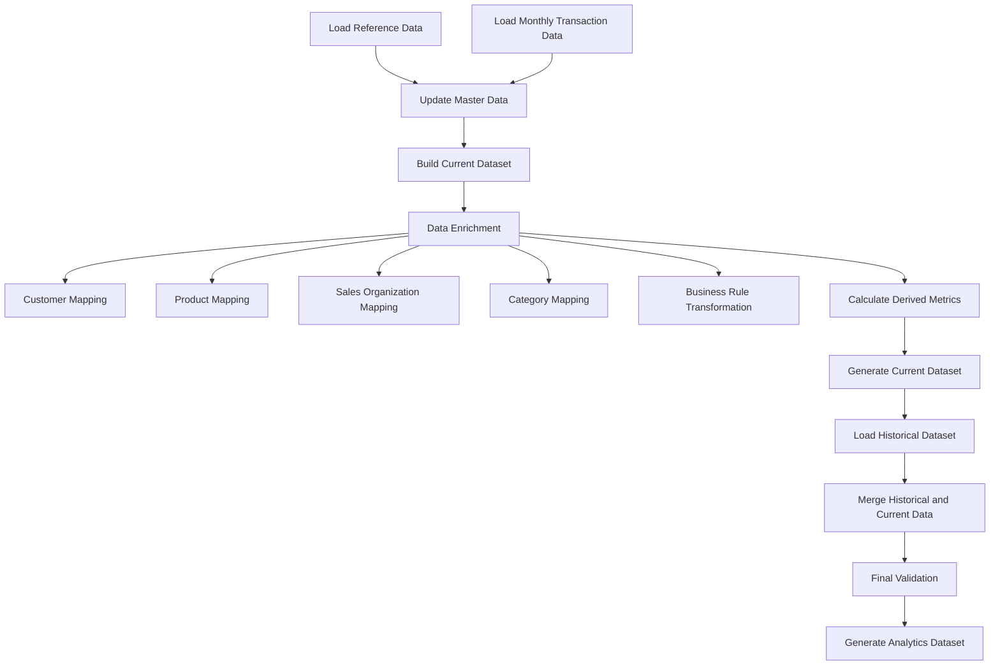

# Sales Data ETL Pipeline

An automated ETL pipeline for processing monthly sales transaction data into a clean, standardized, and analytics-ready dataset.

---

# Business Problem

Organizations generate sales transaction data from multiple operational systems and business channels every month. Before the data can be used for reporting and analysis, it must be consolidated, cleaned, standardized, enriched, and merged with historical records.

Traditionally, this process is performed manually using spreadsheets, leading to several challenges:

- Time-consuming data preparation
- High risk of human error
- Inconsistent master data across reporting periods
- Difficulties handling transaction revisions
- Delayed business reporting

This ETL pipeline automates the entire process, enabling analysts and business users to work with reliable, consistent, and analytics-ready data.

---

# Solution

This project automates the complete monthly ETL workflow by:

- Loading transaction and reference datasets
- Cleaning and standardizing raw data
- Enriching records using multiple master datasets
- Applying business transformation rules
- Calculating derived metrics
- Merging historical and current-period data
- Generating a final dataset ready for reporting and analytics

---

# ETL Architecture



---

# Features

## Data Processing

- Automated ETL workflow
- Data cleaning and normalization
- Customer data standardization
- Product mapping
- Sales organization mapping
- Category mapping
- Business rule transformation
- Duplicate transaction handling
- Historical data integration
- Automated output generation

---

## Data Enrichment

- Customer information enrichment
- Product hierarchy mapping
- Geographic mapping
- Sales organization enrichment
- Reference data integration

---

## Data Quality

- Missing value handling
- Duplicate detection
- Data validation
- Standardized output format
- Historical consistency checks

---

# Project Structure

```text
project/
│
├── raw/
├── master/
├── output/
├── config/
├── script/
│
├── etl_pipeline.py
└── run_etl.bat
```

---

# Requirements

```bash
pip install pandas openpyxl xlrd
```

---

# Workflow

1. Load monthly transaction data.
2. Load reference/master datasets.
3. Standardize customer and product information.
4. Enrich transaction records.
5. Apply business transformation rules.
6. Calculate derived metrics.
7. Merge with historical data.
8. Validate the final dataset.
9. Export the analytics-ready output.

---

# Output

The ETL pipeline generates the following outputs:

| Output | Description |
|----------|-------------|
| Current Dataset | Processed transaction data for the current reporting period |
| Analytics Dataset | Consolidated historical and current transaction data ready for reporting |

---

# Key Transformations

- Customer normalization
- Product hierarchy mapping
- Sales organization mapping
- Geographic mapping
- Business rule transformation
- Duplicate transaction removal
- Historical data merge
- Derived metric calculation

---

# Technologies

| Category | Technology |
|-----------|------------|
| Language | Python |
| Data Processing | Pandas |
| Excel Processing | OpenPyXL |
| Data Source | Excel |
| ETL | Extract, Transform, Load |

---

# Future Improvements

- Configuration using YAML
- Logging framework
- Automated testing
- Incremental processing
- Database integration
- Apache Airflow orchestration
- Docker containerization
- CI/CD pipeline

---

# Skills Demonstrated

- ETL Development
- Data Cleaning
- Data Transformation
- Data Validation
- Data Integration
- Data Engineering
- Python Automation
- Pandas
- Excel Automation
- Business Data Processing

---

# Disclaimer

This repository demonstrates the ETL architecture and data processing workflow only.

To protect confidential business information:

- No proprietary datasets are included.
- All configuration values have been anonymized.
- Internal business rules have been generalized.
- Sample datasets (if provided) contain fictional or anonymized data.

---

# Author

Developed as a personal Data Engineering portfolio project demonstrating ETL automation, data transformation, and analytics dataset generation.