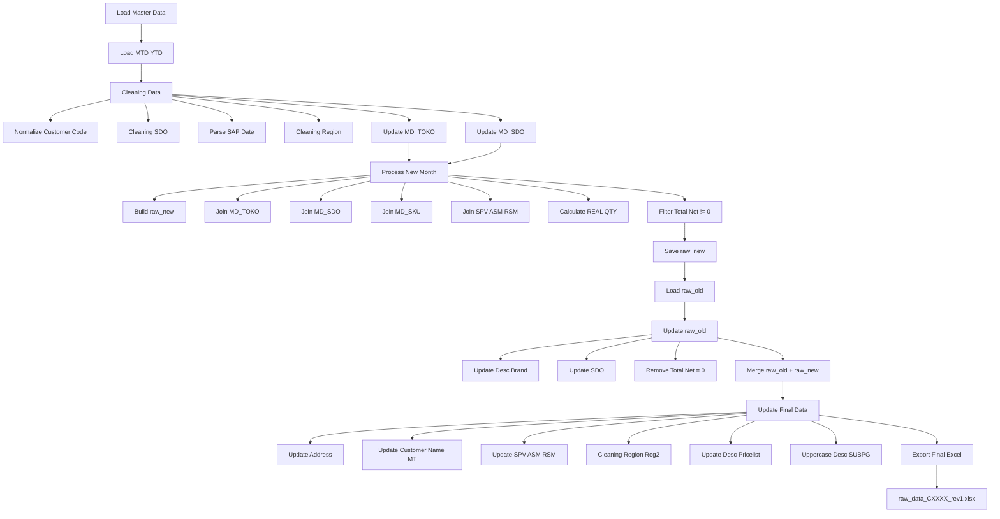
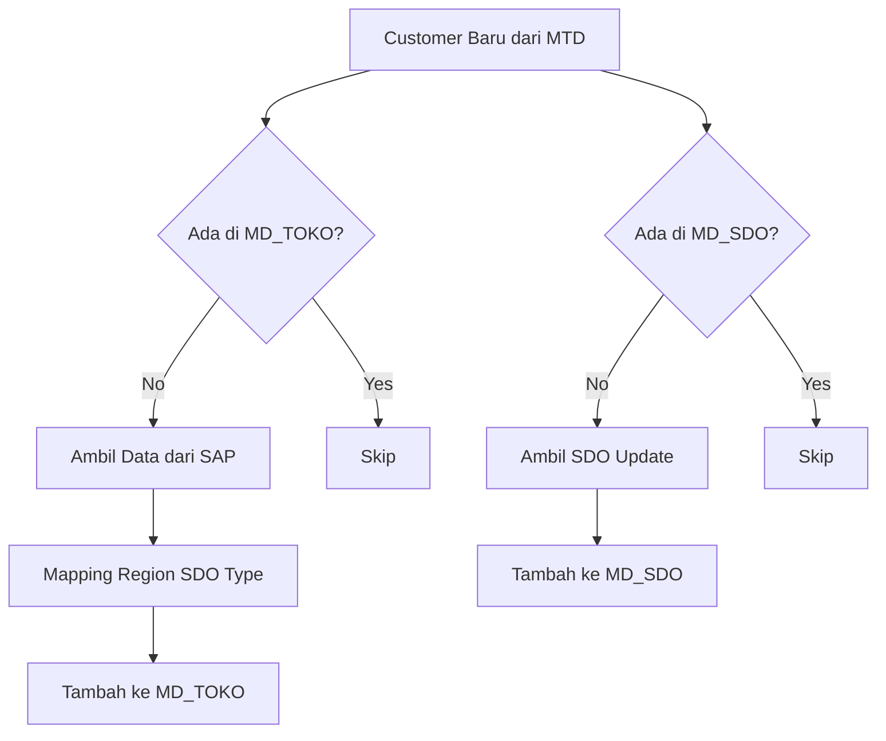
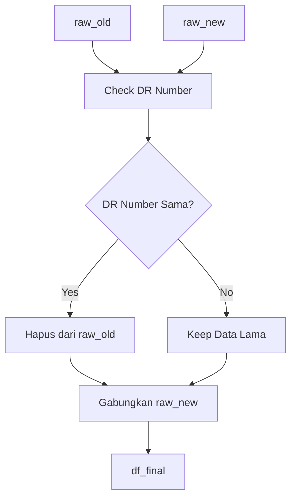
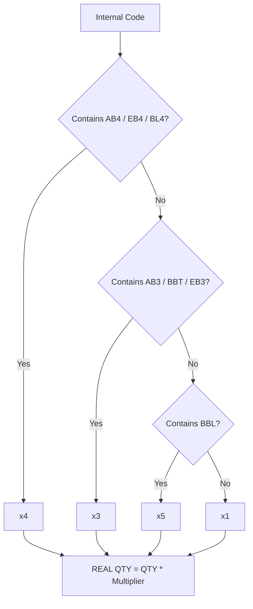
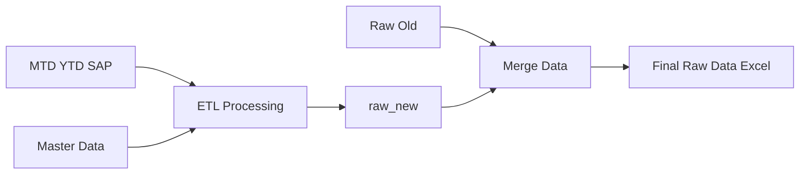

# ETL Sell-In Bulanan

Script ETL otomatis untuk proses data **Sell-In bulanan** dari SAP menjadi file raw data final yang siap digunakan untuk reporting dan analisis.

---

# Overview

Flow utama script:



---

# Fitur Utama

- Cleaning data customer & region
- Normalisasi customer code
- Update otomatis:
  - MD_TOKO
  - MD_SDO
  - SDO Update
  - SPV / ASM / RSM
  - Desc product dari pricelist
- Merge data raw lama + raw baru
- Handle duplicate DR Number
- Kalkulasi REAL QTY
- Update alamat Google Maps otomatis
- Standardisasi region & reg2
- Export otomatis ke Excel final

---

# Struktur File

## File Python

```bash
sellin_etl.py
```

Script utama ETL.

## File BAT

```bash
run_sellin_etl.bat
```

Digunakan untuk menjalankan ETL tanpa buka terminal manual.

---

# Requirement

Install dependency berikut:

```bash
pip install pandas openpyxl xlrd
```

---

# Struktur Master Data

Script menggunakan beberapa file master:

| File | Fungsi |
|---|---|
| Raw Data Sell IN | Data histori utama |
| TEMPLATE_SELL_IN_SAP | MD_TOKO & MD_SDO |
| SAP Customer Master | Data customer SAP |
| MTD YTD REPORT | Data transaksi bulan berjalan |
| SDO UPDATE | Update SDO terbaru |
| SKU Master | Mapping SKU |
| SPV RSM | Mapping SPV/ASM/RSM |
| MS DC | Update desc/brand |
| Master Data Yee | Mapping PG |
| Group | Mapping customer group |
| SWM Grouping | Mapping SUBPG1 |
| Pricelist | Update description terbaru |

---

# Cara Menjalankan

## 1. Update CONFIG

Di bagian atas script:

```python
PATH_RAW_OLD    = r"..."
PATH_TEMPLATE   = r"..."
PATH_SAP        = r"..."
PATH_MTD_YTD    = r"..."
```

Sesuaikan seluruh path file.

---

## 2. Update Cycle Bulanan

```python
CYCLE       = "C05"
DUMMY_CYCLE = "C0526"
MTD_SHEET   = "SAP CUMULATIVE"
```

Contoh:

| Bulan | CYCLE | DUMMY_CYCLE |
|---|---|---|
| Mei 2026 | C05 | C0526 |
| Juni 2026 | C06 | C0626 |

---

## 3. Jalankan Script

### Via terminal

```bash
python sellin_etl.py
```

### Atau via BAT

Double click:

```bash
run_sellin_etl.bat
```

---

# Output

Script menghasilkan 2 file:

| Output | Fungsi |
|---|---|
| raw_new_CXXXX.xlsx | Data bulan baru |
| raw_data_CXXXX_rev1.xlsx | Data final gabungan |

Contoh:

```bash
raw_new_C0526.xlsx
raw_data_C0526_rev1.xlsx
```

---

# Penjelasan Proses ETL

## 1. Load Master Data

Function:

```python
load_master_data()
```

Load seluruh master data yang dibutuhkan.

---

## 2. Update MD_TOKO

Function:

```python
update_md_toko()
```

Menambahkan customer baru otomatis dari SAP & MTD.

### Flow Update MD_TOKO & MD_SDO



---

## 3. Update MD_SDO

Function:

```python
update_md_sdo()
```

Update SDO customer:
- dari file konfirmasi
- fallback dari MTD

---

## 4. Process New Month

Function:

```python
process_new_month()
```

Tahapan:
- build raw_new
- merge seluruh master
- mapping SKU
- hitung REAL QTY
- generate cycle
- filtering Total Net = 0

---

## 5. Merge Raw Lama + Baru

Function:

```python
update_master_data()
```

Logic:
- DR Number lama yang direvisi dihapus
- raw_new replace raw_old

### Flow Merge DR Number



---

## 6. Update Final Data

Termasuk:
- update alamat
- update desc
- update region
- update SPV/ASM/RSM
- update customer modern trade

---

# Function Penting

| Function | Fungsi |
|---|---|
| cleaning_type | Cleaning customer group |
| cleaning_region | Cleaning region |
| normalize_customer_code | Format customer code |
| cleaning_sdo | Cleaning nama SDO |
| parse_sap_date | Convert tanggal SAP |
| realqty | Hitung multiplier qty |

---

# Logic REAL QTY

Contoh:

| Internal Code | Multiplier |
|---|---|
| AB4 / EB4 | x4 |
| AB3 / BBT | x3 |
| BBL | x5 |
| lainnya | x1 |

Formula:

```python
REAL QTY = QTY * multiplier
```

### Flow REAL QTY



---

# Handling Duplicate DR Number

Script otomatis:

```python
raw_old_filtered = raw_old[~raw_old['DR Number'].isin(doc_revisi)]
```

Tujuan:
- menghapus transaksi lama yang sudah direvisi
- mengganti dengan data terbaru

---

# Standardisasi Region

Function:

```python
cleaning_reg2()
```

Contoh mapping:

| RSM / ASM | Region |
|---|---|
| IMAM SHOVII | CENTRAL JAVA |
| JEKY TIRTA | SULAWESI |
| IMAM TAUFIQ | WEST JAVA |

---

# Error yang Sering Terjadi

## File tidak ditemukan

```python
FileNotFoundError
```

Cek:
- path file
- nama file
- extension

---

## Sheet tidak ditemukan

```python
ValueError: Worksheet not found
```

Cek:

```python
MTD_SHEET = "SAP CUMULATIVE"
```

Pastikan nama sheet benar.

---

## Kolom tidak ada

```python
KeyError
```

Biasanya karena:
- format file berubah
- nama kolom SAP berubah

---

# Best Practice

Disarankan struktur folder:

```bash
project/
│
├── raw/
├── master/
├── output/
├── script/
└── backup/
```

---

# Future Improvement

Beberapa improvement yang bisa ditambahkan:

- Logging otomatis
- Config YAML
- GUI sederhana
- Auto detect cycle
- Database integration
- Scheduler automation
- Error report otomatis
- Email notification

---

# Simple Architecture Flow



---

# Author

Developed for internal ETL automation & sell-in reporting process.

