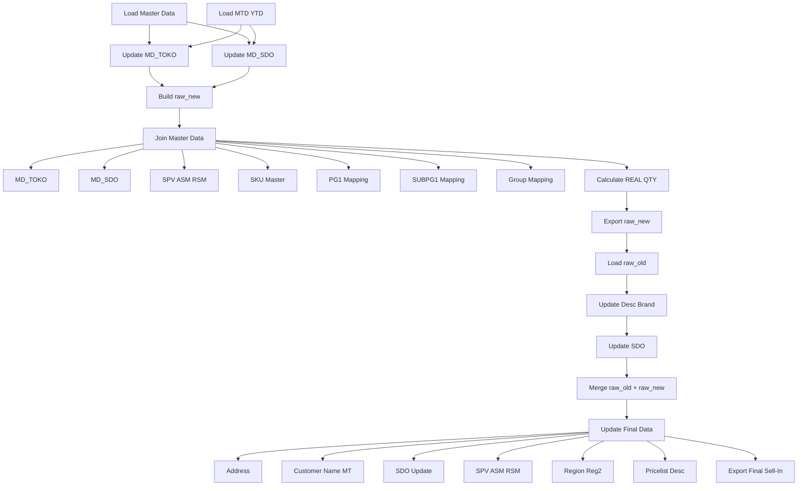

# ETL Sell-In Bulanan

Automation ETL untuk proses pengolahan data Sell-In bulanan dari SAP menjadi raw data final yang siap digunakan untuk reporting dan analisa bisnis.

---

# Business Problem

Data Sell-In merupakan data penjualan perusahaan yang berasal dari berbagai channel distribusi seperti Retail, Grosir, Modern Trade, Projects, dan channel lainnya.

Setiap bulan data transaksi diperoleh dari berbagai sumber master data dan file SAP yang perlu dilakukan proses cleaning, standardisasi, mapping, serta penggabungan dengan data historis.

Sebelum automation ini dibuat, proses pengolahan data dilakukan secara manual menggunakan Excel sehingga:

- Membutuhkan waktu yang lama untuk proses konsolidasi data
- Rentan terjadi human error saat mapping dan update master data
- Sulit menjaga konsistensi data antar periode
- Membutuhkan effort besar untuk melakukan revisi data transaksi
- Proses analisa menjadi lebih lambat karena data belum siap digunakan

Data Sell-In ini menjadi salah satu sumber utama analisa performa penjualan yang digunakan oleh Manager, ASM, RSM, dan Management setiap bulan untuk:

- Monitoring penjualan per channel
- Monitoring penjualan per area dan region
- Analisa performa SDO
- Analisa produk dan kategori
- Tracking pertumbuhan penjualan bulanan
- Penyusunan strategi penjualan berikutnya

Automation ETL ini dibuat untuk mempercepat proses pengolahan data, meningkatkan akurasi, dan menghasilkan raw data yang siap digunakan untuk reporting dan analisa bisnis.

---

# Solution

Script ini mengotomatisasi seluruh proses ETL mulai dari:

- Load data SAP dan master data
- Cleaning dan standardisasi data
- Update master customer dan SDO
- Mapping produk dan organisasi sales
- Perhitungan REAL QTY
- Penggabungan data historis dan data bulan berjalan
- Update informasi customer, region, dan product hierarchy
- Generate raw data final siap analisa

---

# ETL Architecture



---

# Features

## Customer & Master Data

- Auto update MD_TOKO
- Auto update MD_SDO
- Customer code normalization
- Customer group standardization
- Customer name update untuk Modern Trade

## Product Mapping

- SKU Mapping
- Internal Code Mapping
- PG Mapping
- SUBPG Mapping
- PG 1 Mapping
- SUBPG1 Mapping
- Pricelist Description Update

## Sales Organization

- SDO Update
- SPV Mapping
- ASM Mapping
- RSM Mapping
- Region Mapping
- Reg2 Mapping

## Data Processing

- Merge raw_old + raw_new
- Duplicate DR Number handling
- REAL QTY calculation
- REG/FREE classification
- Address update
- Data validation

---

# Project Structure

```text
project/
│
├── raw/
├── master/
├── output/
├── script/
├── backup/
│
├── sellin_etl.py
└── run_sellin_etl.bat
```

---

# Requirements

```bash
pip install pandas openpyxl xlrd
```

---

# Master Data Sources

| File | Fungsi |
|--------|---------|
| Raw Data Sell IN | Data histori utama |
| TEMPLATE_SELL_IN_SAP | MD_TOKO dan MD_SDO |
| SAP Customer Master | Master customer SAP |
| MTD YTD REPORT | Data transaksi bulan berjalan |
| SDO UPDATE | Update SDO terbaru |
| SKU Master | Mapping produk |
| SPV RSM | Mapping organisasi sales |
| MS DC | Update desc dan brand |
| Master Data Yee | Mapping PG 1 |
| Group | Mapping customer group |
| SWM Grouping | Mapping SUBPG1 |
| Pricelist | Update description terbaru |

---

# Configuration

Update bagian berikut setiap bulan:

```python
PATH_RAW_OLD
PATH_TEMPLATE
PATH_SAP
PATH_MTD_YTD
PATH_SDO_UPDATE
PATH_MD_SKU
PATH_SPVRSM
PATH_MS_DC
PATH_MD_YEE
PATH_GROUP
PATH_SWM
PATH_PRICELIST
```

Update cycle:

```python
CYCLE = "C06"
DUMMY_CYCLE = "C0626"
```

---

# Cara Menjalankan

## Via Terminal

```bash
python sellin_etl.py
```

## Via BAT

```bash
run_sellin_etl.bat
```

---

# Output

Script menghasilkan:

| Output | Keterangan |
|----------|-----------|
| raw_new_CXXXX.xlsx | Data bulan berjalan |
| raw_data_CXXXX_rev1.xlsx | Data final gabungan |

Contoh:

```text
raw_new_C0626.xlsx
raw_data_C0626_rev1.xlsx
```

---

# Business Rules

## Customer Group Mapping

| SAP Type | Output |
|-----------|---------|
| 2 | RETAIL |
| 3 | GROSIR |
| 5 | OTHERS |
| 16 | SEMI-GROSIR |

---

## REAL QTY Logic

| Internal Code | Multiplier |
|--------------|------------|
| AB4 / EB4 / BL4 / XB4 | x4 |
| AB3 / BBT / EB3 / ER3 / BB2 | x3 |
| BBL | x5 |
| Others | x1 |

Formula:

```text
REAL QTY = QTY × Multiplier
```

---

## REG/FREE Classification

| Condition | Result |
|------------|---------|
| Total (with VAT) < 1000 | FREE |
| Total (with VAT) ≥ 1000 | REG |

---

## Duplicate DR Number Handling

Saat proses merge:

- DR Number yang muncul di raw_new dianggap data terbaru
- Data lama pada raw_old akan dihapus
- Data raw_new akan menggantikan data lama

Tujuan:

- Menghindari double counting
- Mengakomodasi revisi transaksi dari SAP

---

# Final Data Enrichment

Setelah merge selesai dilakukan update:

- Google Maps Address
- Customer Name Modern Trade
- SDO Update
- SPV
- ASM
- RSM
- Region
- Reg2
- Product Description
- PG 1
- SUBPG1

---

# Future Improvements

- YAML Configuration
- Logging System
- Error Handling Report
- Scheduler Automation
- Email Notification
- Database Integration
- Dashboard Integration
- Auto Cycle Detection

---

# Author

Developed for internal Sell-In ETL Automation and Sales Performance Reporting.